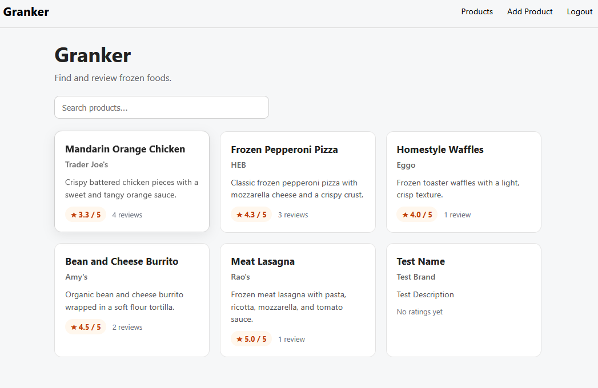
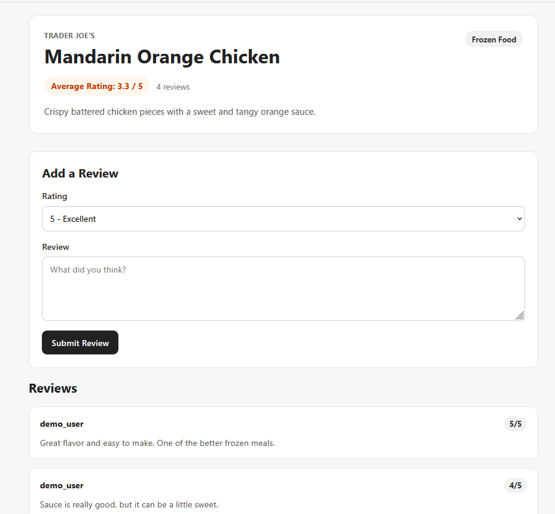
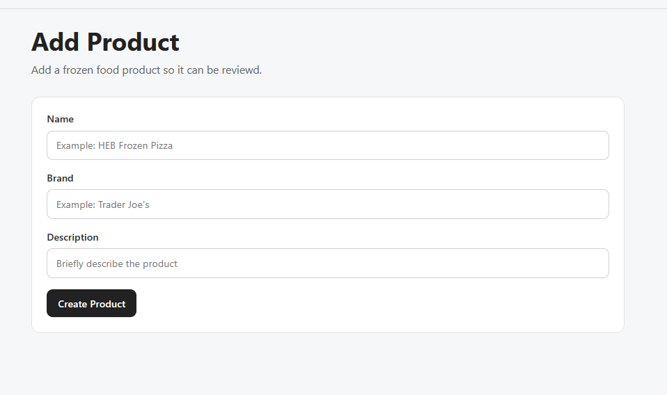
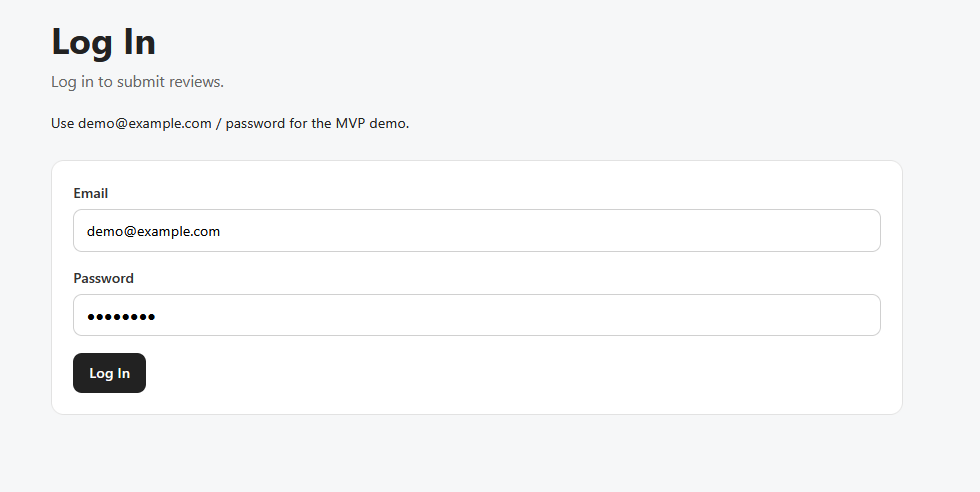

# Granker

Granker is a full-stack frozen foods review app. Users can browse frozen food products, view product details, read reviews, submit reviews, and add new products.

## Features

- View all frozen food products
- Search products by name or brand
- View product details
- View reviews for a specific product
- Submit a review for a product
- Add new products from the frontend
- Basic session-based login flow for submitting review
- Logout support
- Average product ratings

## Tech Stack

### Frontend

- React
- React Router
- JavaScript
- CSS

### Backend

- Java
- Spring Boot
- Spring Security
- Spring Data JPA
- PostgreSQL

### Backend

```bash
cd backend
./mvnw spring-boot:run
```

On Windows PowerShell:

```bash
cd backend
.\mvnw spring-boot:run
```

### Frontend

```bash
cd frontend
npm install
npm run dev
```

## Demo Login

```txt
Email: demo@example.com
Password: password
```

## MVP Status

The first MVP includes product browsing, product details, review submission, product creation, seeded demo data, and basic login flow.

## Future Improvements

- Full registration and login UI
- Review editing and deletion
- Product images
- Product categories
- Nutrition fields
- Sorting and filtering
- Deployment
- Automated tests
- Docker setup

## Version Status

### v1.1.0

This version adds average product ratings, review counts, and logout support.

## Screenshots

### Products Page



### Product Details Page



### Add Product Page



### Login Page


